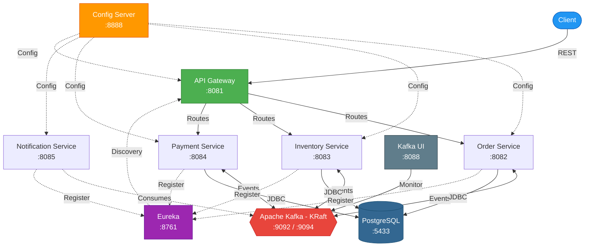
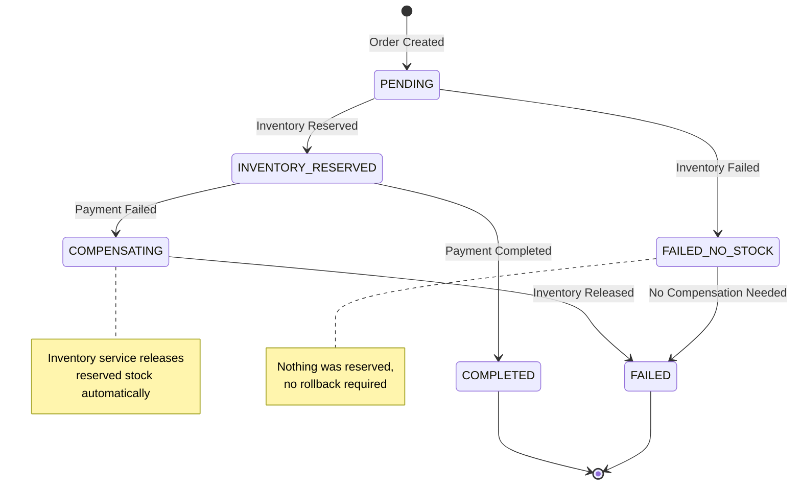
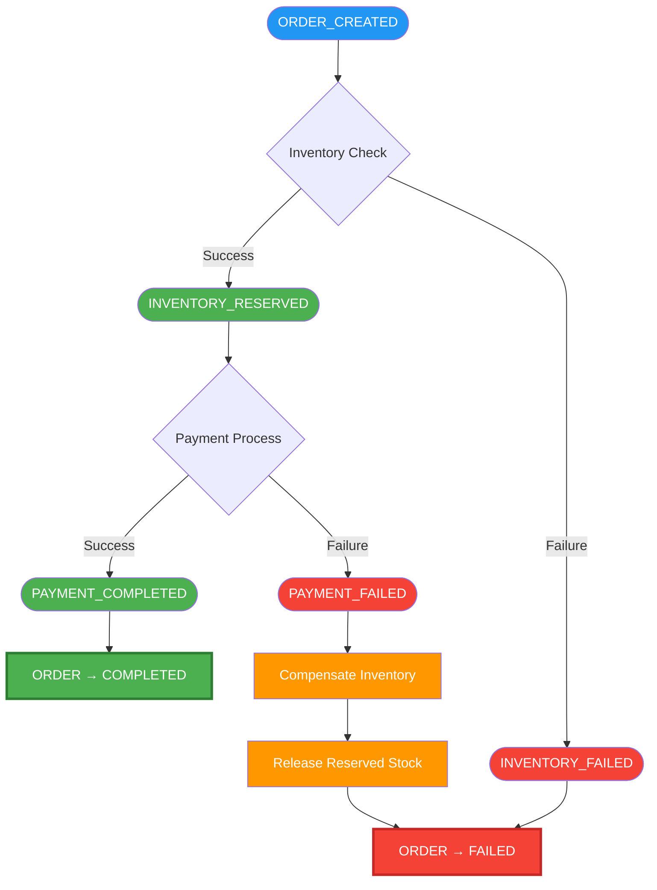
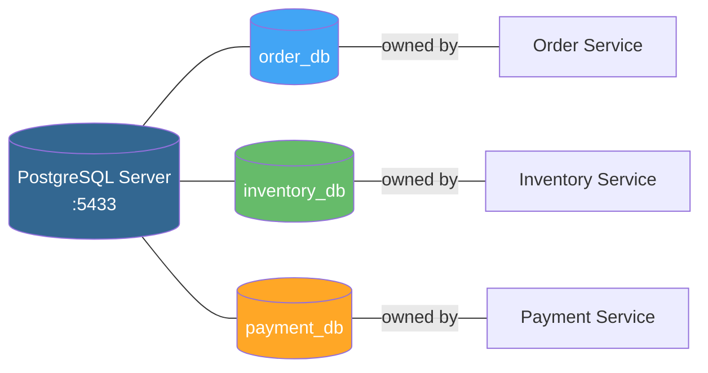
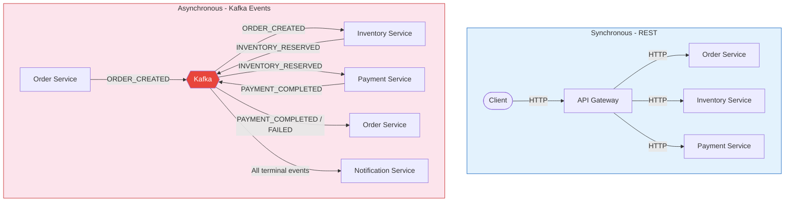
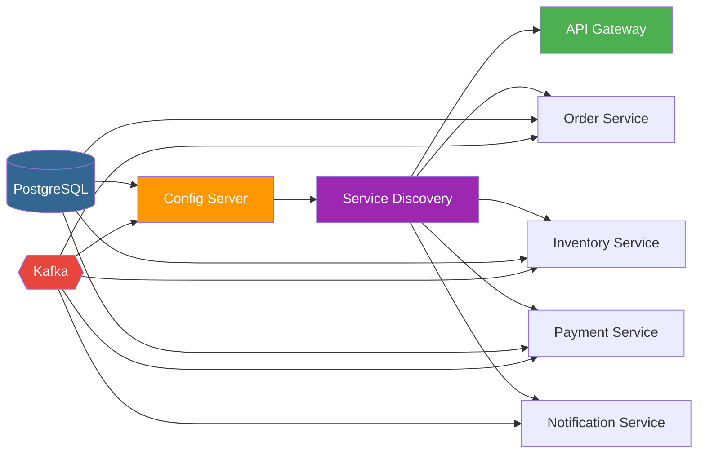

# Architecture

Detailed technical architecture of the Spring Boot Kafka Saga Pattern project.


## Table of Contents

- [System Overview](#system-overview)
- [High-Level Architecture](#high-level-architecture)
- [Service Architecture](#service-architecture)
- [Saga Pattern Implementation](#saga-pattern-implementation)
- [Event Flow](#event-flow)
- [Data Architecture](#data-architecture)
- [Infrastructure Layer](#infrastructure-layer)
- [Communication Patterns](#communication-patterns)
- [Deployment Architecture](#deployment-architecture)
- [Security Considerations](#security-considerations)
- [Design Decisions](#design-decisions)


## System Overview

The system is a **choreography-based saga** implementation for distributed order management. It follows a microservices architecture where each service is independently deployable, owns its data store, and communicates asynchronously through Apache Kafka event streams.

### Architecture Principles

| Principle                     | Implementation                                                        |
| ----------------------------- | --------------------------------------------------------------------- |
| Single Responsibility         | Each service handles one business domain                              |
| Database per Service          | Separate PostgreSQL databases per service                             |
| Asynchronous Communication    | Kafka-based event streaming between services                          |
| Eventual Consistency          | Saga pattern ensures data consistency across services                 |
| Fault Tolerance               | Compensating transactions for automatic rollback                     |
| Centralized Configuration     | Spring Cloud Config Server with native file backend                  |
| Service Discovery             | Netflix Eureka for dynamic registration and lookup                   |
| API Gateway                   | Spring Cloud Gateway as the single entry point                       |


## High-Level Architecture




## Service Architecture

### Order Service (port 8082)

**Role**: Saga orchestrator and order lifecycle manager.

- Accepts order creation requests via REST API
- Publishes `ORDER_CREATED` events to Kafka
- Listens for `INVENTORY_RESERVED`, `INVENTORY_FAILED`, `PAYMENT_COMPLETED`, and `PAYMENT_FAILED` events
- Transitions order status: `PENDING → COMPLETED` or `PENDING → FAILED`
- Owns `order_db` database

**Dependencies**: PostgreSQL, Kafka, Config Server, Eureka


### Inventory Service (port 8083)

**Role**: Stock management with reservation and release capabilities.

- Consumes `ORDER_CREATED` events to reserve inventory
- Publishes `INVENTORY_RESERVED` on success or `INVENTORY_FAILED` on failure
- Consumes `PAYMENT_FAILED` events to release previously reserved stock (compensating transaction)
- Configurable failure rate (`inventory.failure-rate: 0.10`) for testing
- Owns `inventory_db` database

**Dependencies**: PostgreSQL, Kafka, Config Server, Eureka


### Payment Service (port 8084)

**Role**: Payment processing with refund capability.

- Consumes `INVENTORY_RESERVED` events to process payment
- Publishes `PAYMENT_COMPLETED` on success or `PAYMENT_FAILED` on failure
- Configurable failure rate (`payment.failure-rate: 0.10`) for testing
- Owns `payment_db` database

**Dependencies**: PostgreSQL, Kafka, Config Server, Eureka


### Notification Service (port 8085)

**Role**: Event consumer for user notifications.

- Consumes all terminal saga events (completion and failure)
- Stateless service &mdash; no database required
- Logs notification events (extensible to email, SMS, push)

**Dependencies**: Kafka, Config Server, Eureka


## Saga Pattern Implementation

### Pattern Type: Choreography-Based Saga

Each service independently listens for events and reacts accordingly, publishing new events that trigger the next step or compensating actions.

### State Machine





### Compensating Transactions

| Failure Point        | Compensating Action                               |
| -------------------- | ------------------------------------------------- |
| Inventory failure    | No compensation needed (nothing was reserved)     |
| Payment failure      | Inventory service releases the reserved stock     |


## Event Flow

### Kafka Topics

| Topic                    | Producer            | Consumer(s)                          |
| ------------------------ | ------------------- | ------------------------------------ |
| `order-created`          | Order Service       | Inventory Service                    |
| `inventory-reserved`     | Inventory Service   | Payment Service, Order Service       |
| `inventory-failed`       | Inventory Service   | Order Service, Notification Service  |
| `payment-completed`      | Payment Service     | Order Service, Notification Service  |
| `payment-failed`         | Payment Service     | Inventory Service, Order Service, Notification Service |

### Event Schema (JSON)

All events are serialized as JSON with the following common fields:

```json
{
  "orderId": "uuid",
  "productId": "string",
  "quantity": "integer",
  "price": "decimal",
  "customerId": "string",
  "timestamp": "ISO-8601"
}
```

### Message Guarantees

| Property           | Configuration                                           |
| ------------------ | ------------------------------------------------------- |
| Producer idempotence | `enable.idempotence: true`                            |
| Acknowledgments    | `acks: all` (waits for all in-sync replicas)            |
| Deserialization    | `StringDeserializer` + manual `ObjectMapper` parsing    |
| Offset commit      | Manual (`ack-mode: manual_immediate`)                   |
| Auto commit        | Disabled (`enable-auto-commit: false`)                  |
| Offset reset       | `earliest` (process all messages from beginning)        |
| Type headers       | Disabled (`spring.json.add.type.headers: false`)        |


## Data Architecture

### Database per Service Pattern

Each business service owns a dedicated PostgreSQL database, ensuring loose coupling and independent schema evolution.



### Schema Management

- **Migration Tool**: Flyway
- **Strategy**: `ddl-auto: validate` ensures Flyway owns the schema
- **Baseline**: `baseline-on-migrate: true` for brownfield adoption

### Database Initialization

The `docker/init.sql` script creates all three databases on container startup:

```sql
CREATE DATABASE IF NOT EXISTS order_db;
CREATE DATABASE IF NOT EXISTS inventory_db;
CREATE DATABASE IF NOT EXISTS payment_db;
```


## Infrastructure Layer

### Config Server (port 8888)

- **Backend**: Native filesystem (`configs/` directory)
- **Profile**: `native` profile for local file-based configuration
- **Health Check**: HTTP health endpoint with 10s polling interval
- Serves per-service YAML configuration files

### Service Discovery - Eureka (port 8761)

- All services register on startup
- API Gateway uses Eureka for dynamic route resolution
- Health check: HTTP health endpoint with 10s polling interval

### API Gateway (port 8081)

- **Framework**: Spring Cloud Gateway
- Routes client requests to downstream services via Eureka
- Single entry point simplifying client-side access

### Kafka (KRaft Mode)

- **No ZooKeeper**: Uses KRaft (Kafka Raft) for self-managed metadata
- **Listeners**: Internal (`kafka:9092`) and external (`localhost:9094`)
- **Replication Factor**: 1 (single-node development setup)
- **Health Check**: Verifies topic listing every 10 seconds

### Kafka UI (port 8088)

- Web-based dashboard for Kafka cluster monitoring
- Topic browsing, message inspection, consumer group tracking


## Communication Patterns

### Synchronous (REST)

- **Client → API Gateway → Services**: HTTP/REST for command operations (e.g., create order)
- **Service → Config Server**: HTTP for configuration retrieval on startup
- **Service → Eureka**: HTTP for service registration and heartbeats

### Asynchronous (Kafka)

- **Service → Service**: Event-driven via Kafka topics for saga coordination
- **Fire-and-forget**: Producers publish events without waiting for consumer acknowledgment
- **Consumer Groups**: Each service uses a dedicated consumer group ID for independent offset tracking




## Deployment Architecture

### Docker Compose Profiles

The project provides multiple Docker Compose files for different deployment scenarios:

| File                         | Purpose                                                     |
| ---------------------------- | ----------------------------------------------------------- |
| `docker-compose.yml`         | Root compose: PostgreSQL, Kafka, Kafka UI                   |
| `docker/infra.compose.yml`   | Infrastructure only: PostgreSQL, Kafka, Kafka UI            |
| `docker/deps.compose.yml`    | Full stack: All infrastructure + all microservices           |

### Container Network

All containers run on the `saga-network` bridge network, enabling inter-container DNS resolution.

### Startup Order

The Docker Compose dependency chain ensures correct startup ordering:



### Container Images

All services use `eclipse-temurin:17-jre-alpine` as the base image for minimal footprint.


## Security Considerations

> **Note**: This is a development/demonstration project. The following items should be addressed for production use.

| Area                     | Current State                | Production Recommendation                    |
| ------------------------ | ---------------------------- | -------------------------------------------- |
| Database credentials     | Hardcoded in `.env.example`  | Use a secret manager (Vault, AWS Secrets)    |
| Kafka authentication     | PLAINTEXT (no auth)          | Enable SASL/SSL authentication               |
| API authentication       | None                         | Add OAuth2 / JWT via API Gateway             |
| Network encryption       | None                         | Enable TLS for all inter-service traffic     |
| Config Server             | No auth                     | Secure with basic auth or vault backend      |


## Design Decisions

### Why Choreography over Orchestration?

- **Decoupled**: Services don't know about each other; they only know about events
- **Simpler**: No central orchestrator service to maintain
- **Resilient**: Failure of one service doesn't cascade (events are persisted in Kafka)

### Why KRaft over ZooKeeper?

- ZooKeeper is deprecated in newer Kafka versions
- KRaft simplifies the deployment (fewer containers)
- Better startup performance and operational simplicity

### Why StringDeserializer + ObjectMapper?

- Avoids Spring Kafka's type-mapping header conflicts across services
- Each consumer controls its own deserialization logic
- Eliminates `ClassNotFoundException` from mismatched type headers

### Why Manual Acknowledgment?

- Prevents message loss on consumer crashes
- Enables at-least-once processing semantics
- Combined with idempotent producers for reliable delivery

### Why Database per Service?

- Services can evolve schemas independently
- No cross-service database coupling
- Each service can choose its own storage technology in the future


<p align="center">
  See <a href="README.md">README.md</a> for setup instructions.
</p>
