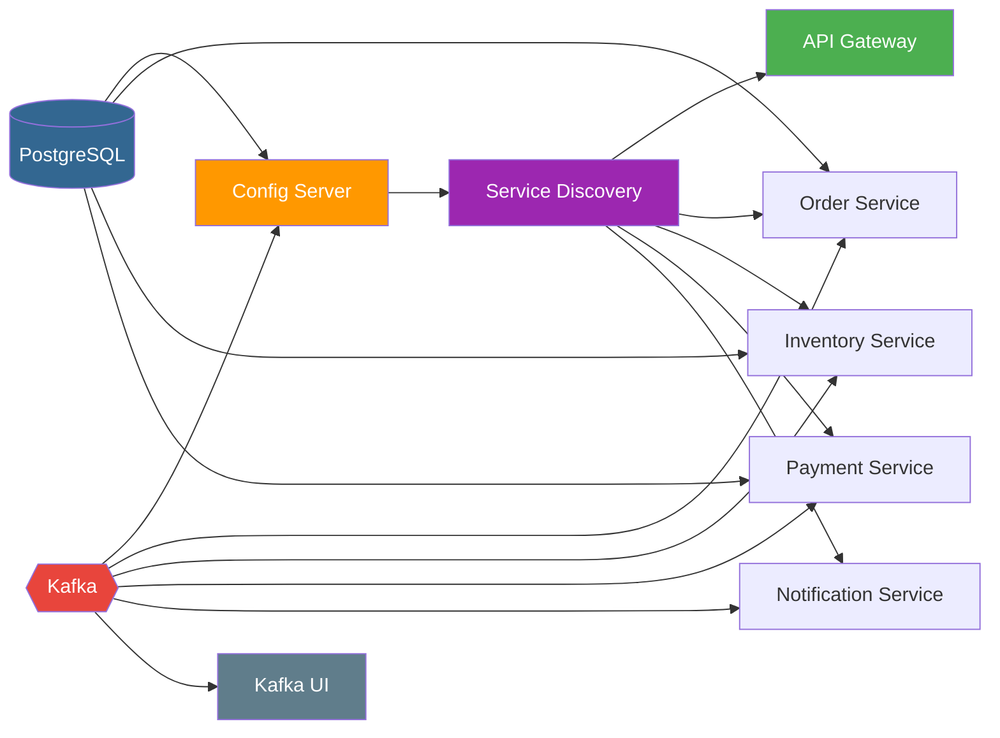
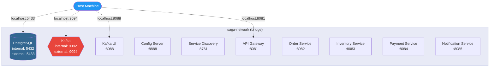

# Docker Setup

This directory contains Docker Compose definitions and initialization scripts for running the project's infrastructure and services in containers.


## Files

| File                  | Description                                                       |
| --------------------- | ----------------------------------------------------------------- |
| `infra.compose.yml`   | Infrastructure only: PostgreSQL, Kafka (KRaft), Kafka UI          |
| `deps.compose.yml`    | Full stack: Infrastructure + Config Server + Eureka + Gateway + all business services |
| `init.sql`            | PostgreSQL initialization script (creates databases on first run) |


## Quick Start

### Infrastructure Only (for local development)

Use this when you want to run business services locally (via IDE or `mvn spring-boot:run`) but need Kafka and PostgreSQL:

```bash
# Start infrastructure
docker compose -f docker/infra.compose.yml up -d

# Verify all containers are healthy
docker compose -f docker/infra.compose.yml ps

# Stop infrastructure
docker compose -f docker/infra.compose.yml down

# Stop and remove all data volumes
docker compose -f docker/infra.compose.yml down -v
```

### Full Stack (everything in containers)

Use this for end-to-end testing or demo purposes:

```bash
# Build all services first
mvn clean package -DskipTests

# Start everything
docker compose -f docker/deps.compose.yml up -d --build

# Verify
docker compose -f docker/deps.compose.yml ps

# View logs for a specific service
docker compose -f docker/deps.compose.yml logs -f order-service

# Stop everything
docker compose -f docker/deps.compose.yml down
```


## Container Details

### Infrastructure Containers

| Container     | Image                          | Port(s)       | Health Check                            |
| ------------- | ------------------------------ | ------------- | --------------------------------------- |
| `postgres`    | `postgres:15-alpine`           | `5433:5432`   | `pg_isready -U postgres` (every 5s)     |
| `kafka`       | `confluentinc/cp-kafka:7.6.0`  | `9092`, `9094`| `kafka-topics --list` (every 10s)       |
| `kafka-ui`    | `provectuslabs/kafka-ui:latest`| `8088:8080`   | None (depends on Kafka health)          |

### Application Containers (Full Stack Only)

| Container              | Port   | Depends On                               |
| ---------------------- | ------ | ---------------------------------------- |
| `config-server`        | `8888` | None                                     |
| `service-discovery`    | `8761` | Config Server                            |
| `api-gateway`          | `8081` | Service Discovery                        |
| `order-service`        | `8082` | PostgreSQL, Kafka, Service Discovery     |
| `inventory-service`    | `8083` | PostgreSQL, Kafka, Service Discovery     |
| `payment-service`      | `8084` | PostgreSQL, Kafka, Service Discovery     |
| `notification-service` | `8085` | Kafka, Service Discovery                 |

### Startup Dependency Graph




## Networking

All containers communicate over a shared Docker bridge network:



- **Internal Kafka listener**: `kafka:9092` (container-to-container)
- **External Kafka listener**: `localhost:9094` (host machine access)
- **PostgreSQL**: `postgres:5432` (internal) / `localhost:5433` (external)


## Database Initialization

The `init.sql` file runs automatically on the first PostgreSQL container startup:

```sql
CREATE DATABASE IF NOT EXISTS order_db;
CREATE DATABASE IF NOT EXISTS inventory_db;
CREATE DATABASE IF NOT EXISTS payment_db;
```

> **Note**: This script only runs when the PostgreSQL data volume is empty (first-time setup). To re-run it, remove the volume: `docker volume rm docker_postgres_data`


## Kafka Configuration (KRaft Mode)

Kafka runs in **KRaft mode** (no ZooKeeper required):

| Setting                                | Value                                   |
| -------------------------------------- | --------------------------------------- |
| **Mode**                               | Combined broker + controller            |
| **Cluster ID**                         | `MkU3OEVBNTcwNTJENDM2Qk`               |
| **Internal Listener**                  | `PLAINTEXT://kafka:9092`                |
| **External Listener**                  | `PLAINTEXT_HOST://localhost:9094`       |
| **Controller Quorum**                  | `1@kafka:29093`                         |
| **Replication Factor**                 | `1` (single-node dev setup)             |
| **Offsets Topic Replication**          | `1`                                     |
| **Transaction Log Min ISR**            | `1`                                     |


## Volumes

| Volume          | Purpose                                              |
| --------------- | ---------------------------------------------------- |
| `postgres_data` | Persists PostgreSQL data across container restarts    |


## Accessing UIs

| UI             | URL                     | Description                              |
| -------------- | ----------------------- | ---------------------------------------- |
| Kafka UI       | http://localhost:8088    | Browse topics, messages, consumer groups  |
| Eureka         | http://localhost:8761    | View registered services (full stack)    |


## Useful Commands

```bash
# View real-time logs across all containers
docker compose -f docker/deps.compose.yml logs -f

# Restart a single service
docker compose -f docker/deps.compose.yml restart order-service

# Rebuild and restart a single service
docker compose -f docker/deps.compose.yml up -d --build order-service

# Check Kafka topics
docker exec kafka kafka-topics --bootstrap-server localhost:9092 --list

# Produce a test message
docker exec -it kafka kafka-console-producer \
  --bootstrap-server localhost:9092 \
  --topic order-created

# Consume messages from a topic
docker exec kafka kafka-console-consumer \
  --bootstrap-server localhost:9092 \
  --topic order-created \
  --from-beginning

# Connect to PostgreSQL
docker exec -it postgres psql -U postgres -d order_db

# Check container resource usage
docker stats
```


## Troubleshooting

| Problem                                     | Solution                                                           |
| ------------------------------------------- | ------------------------------------------------------------------ |
| Port already in use                         | Stop conflicting services or change ports in the compose file      |
| Kafka container keeps restarting             | Check logs: `docker logs kafka`. Ensure no other Kafka is running  |
| PostgreSQL init.sql not running             | Remove the volume: `docker compose down -v` then re-start          |
| Services can't reach Config Server          | Ensure `config-server` is healthy before dependent services start  |
| Consumer can't connect to Kafka             | Use `kafka:9092` inside containers, `localhost:9094` from host     |
